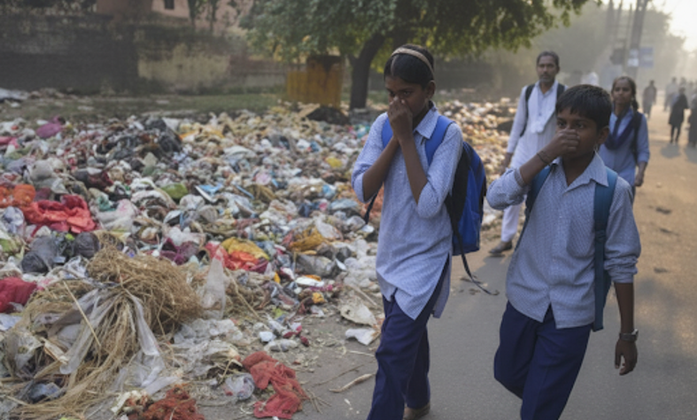
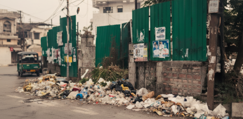
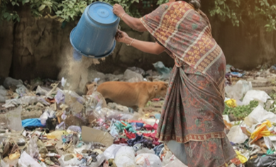
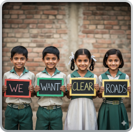
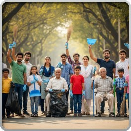

# Highway Guard | हायवे गार्ड  

**"No litter on roads, only the legacy of cleanliness."**  
**"रस्त्यावर कचरा नाही, फक्त स्वच्छतेची परंपरा."**  

Highway Guard is a social initiative aimed at tackling the persistent problem of littering on highways and public roads in India.  
हायवे गार्ड हा भारतातील महामार्ग आणि सार्वजनिक रस्त्यांवरील कचरा फेकण्याच्या समस्येवर मात करण्यासाठी एक सामाजिक उपक्रम आहे.  

---

## 🌍 The Problem | समस्या  

- The Swachh Bharat Abhiyan (Clean India Mission) started in 2014, yet highways, cities, and auto/garbage carts still face large-scale littering.  
- 2014 मध्ये स्वच्छ भारत अभियान सुरू झाला, तरीही महामार्ग, शहरे आणि ऑटो/कचरा गाड्यांमध्ये अजूनही मोठ्या प्रमाणावर कचरा फेकला जातो.  

- Despite ongoing cleanliness drives, highways and public roads often suffer from irresponsible littering.  
- चालू स्वच्छता मोहिमांनंतरही महामार्ग आणि रस्ते अजूनही कचऱ्याने भरलेले असतात.  

- Every day, thousands of sanitation workers clean tirelessly, making their lives more difficult and risky due to continued littering.  
- रोज हजारो स्वच्छता कामगार अथकपणे सफाई करतात, सततच्या कचरा फेकण्यामुळे त्यांचे जीवन अधिक कठीण आणि धोकादायक होते.  

- Sanitation workers, who clean tirelessly every day, face severe health risks and unsafe working conditions.  
- रोज मेहनत करणाऱ्या स्वच्छता कामगारांना गंभीर आरोग्य धोक्यांना सामोरे जावे लागते.  

- Authorities struggle with the absence of real-time monitoring and actionable evidence against offenders.  
- अधिकाऱ्यांकडे तत्काळ पुरावे आणि नियंत्रण नसल्यामुळे गुन्हेगारांविरुद्ध कारवाई करणे कठीण होते.  

  
  
  

---

## 💡 The Idea | संकल्पना  

Highway Guard envisions a **cleaner, greener India** by discouraging littering behavior and enabling swift accountability.  
हायवे गार्डचा उद्देश लोकांच्या कचरा फेकण्याच्या सवयींना थांबवून स्वच्छ आणि हिरवेगार भारत निर्माण करणे आहे.  

This initiative works to:  
हा उपक्रम खालीलसाठी कार्य करतो:  

- Deter people from throwing waste on highways.  
- महामार्गांवर कचरा फेकण्यापासून लोकांना परावृत्त करणे.  

- Reduce the workload and health risks of sanitation workers.  
- स्वच्छता कामगारांचा ताण व आरोग्य धोके कमी करणे.  

- Support authorities with evidence for immediate action.  
- अधिकाऱ्यांना तातडीने कारवाईसाठी पुरावे उपलब्ध करून देणे.  

- Build long-term social habits of cleanliness and responsibility.  
- दीर्घकालीन स्वच्छतेच्या सवयी आणि जबाबदारी निर्माण करणे.  

<video width="100%" controls>
  <source src="assets/idea1.mp4" type="video/mp4">
  Your browser does not support the video tag.
</video>

---

## 🌟 Social Impact | सामाजिक परिणाम  

- **Cleaner Roads, Healthier Communities** → Reduced waste on highways leads to safer, more hygienic travel.  
- **स्वच्छ रस्ते, निरोगी समाज** → महामार्गांवर कचरा कमी झाल्याने सुरक्षित आणि आरोग्यदायी प्रवास होतो.  

- **Empowering Sanitation Workers** → Better conditions and reduced risks.  
- **स्वच्छता कामगारांचा सन्मान** → सुरक्षित वातावरण व कमी धोके.  

- **Changing Mindsets** → Encourages individuals to act responsibly.  
- **मानसिकता बदलणे** → जबाबदारीची जाणीव निर्माण होते.  

- **National Contribution** → Supports the Clean India Mission.  
- **राष्ट्रीय योगदान** → स्वच्छ भारत अभियानाला मदत.  

  
  

---

## 🎥 Project Video | प्रकल्प व्हिडिओ  

👉 Watch here | येथे पहा: [Highway Guard - YouTube](https://youtu.be/Fcjx8e_WLYA)  

---

## 🚀 Vision | दृष्टी  

Highway Guard is not just a project—it’s a **movement towards a legacy of cleanliness**.  
हायवे गार्ड फक्त एक प्रकल्प नाही—तो **स्वच्छतेच्या परंपरेसाठी एक चळवळ** आहे.  

*"Highway Guard – From Technology to Cleanliness, building a legacy of cleanliness for India."*  
*"हायवे गार्ड – तंत्रज्ञानातून स्वच्छतेकडे, भारतासाठी स्वच्छतेची परंपरा निर्माण करणारा."*  

---
 
